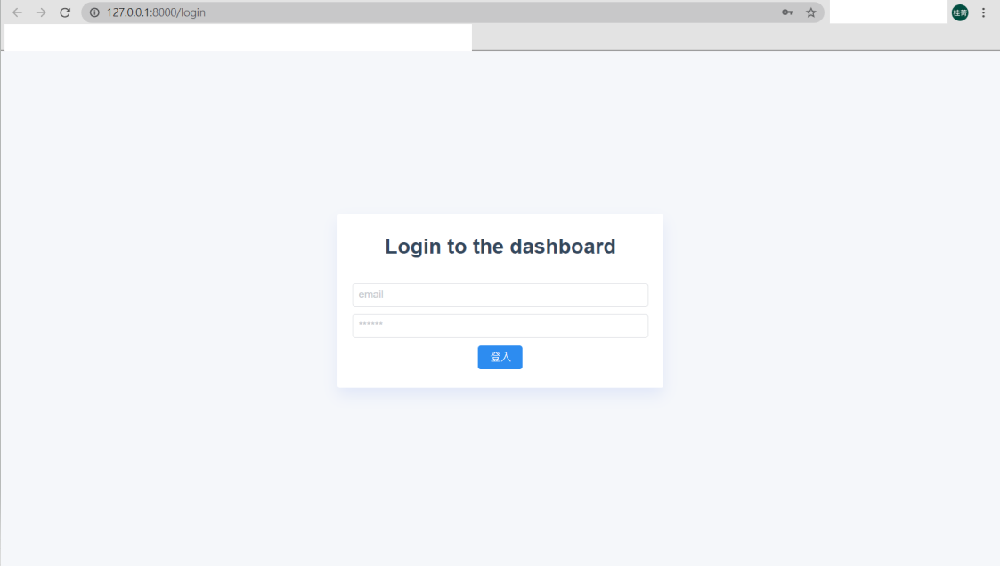
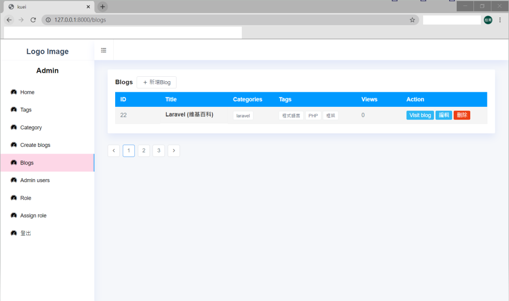
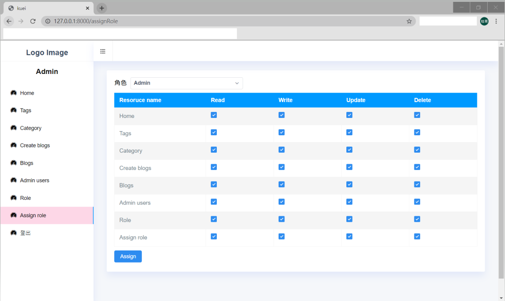
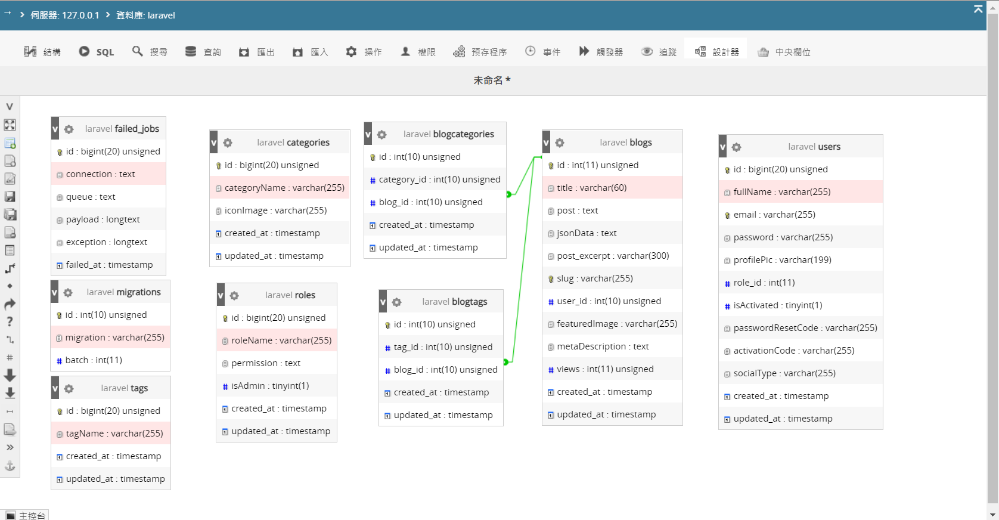
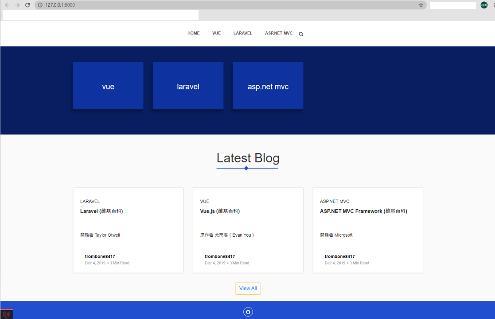
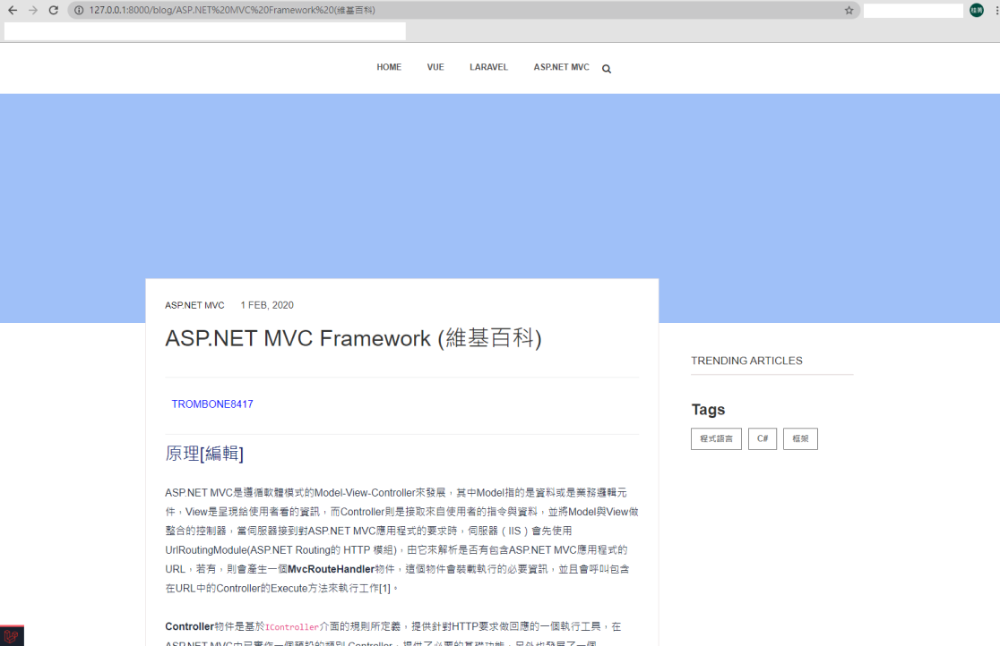

# laravel
## 介紹
本篇參考自youtube教學影片(詳見資料來源)，進行blog的練習，前端及後端分開為兩個專案，前端為laravel-blog，後端為laravel-admin，使用同一個資料庫laravel，語言框架為laravel+vue.js，除錯方式除了F12 Console，另使用laravel-debugbar套件進行除錯，編輯器使用Visual Studio Code。
## 起始專案

1. 請分別在不同的local端進行，因為起始專案的設定都是http://127.0.0.1:8000

2. 需進入各自的專案進行指令

3. google 搜尋 : How to Setup a Laravel Project You Cloned from Github.com

4. `\laravel\laravel-admin> php artisan serve`

4. `\laravel\laravel-admin> npm run watch`

4. `\laravel\laravel-blog> php artisan serve`

4. `\laravel\laravel-blog> npm run watch`

## 1. laravel-admin
### 演示圖片
##### admin 登入頁面

##### admin Blog頁面

##### admin 權限設定頁面

##### 資料庫關聯圖

## 2. laravel-blog
### 演示圖片
##### admin 登入頁面

##### admin Blog頁面

## 資料來源
Youtube: Full stack laravel and vue.js development from scratch | Building a real world seo friendly blog with admin panel (作者：AppifyLab)